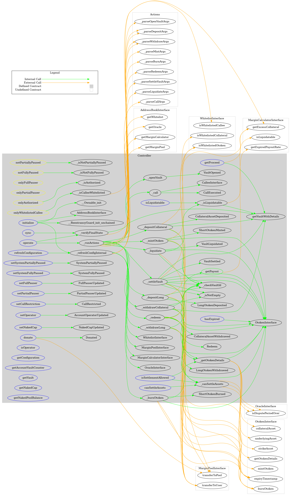
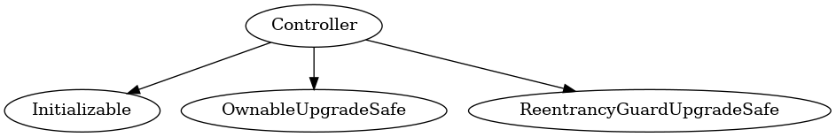
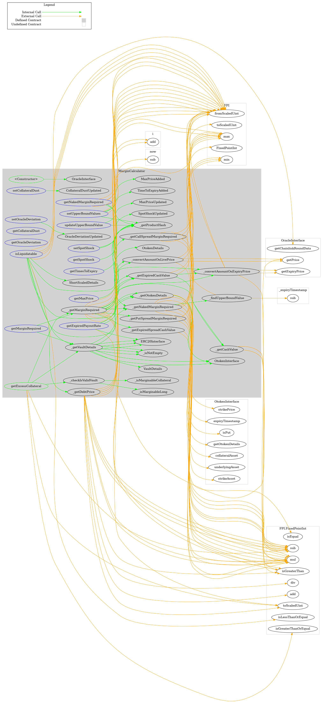
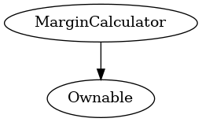
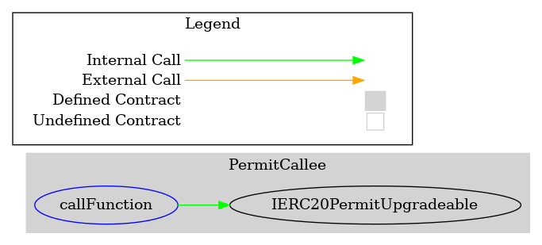
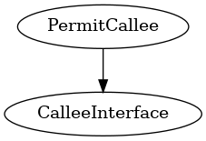
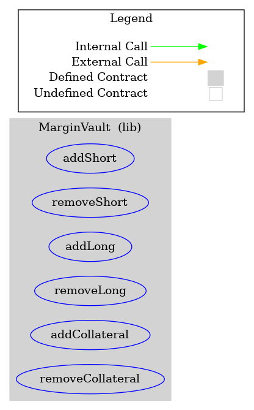

<div id="splash">
    <div id="project">
          <span class="splash-title">
               Project
          </span>
          <br />
          <span id="project-value">
               Gamma
          </span>
    </div>
     <div id="details">
          <div id="left">
               <span class="splash-title">
                    Client
               </span>
               <br />
               <span class="details-value">
                    Opyn
               </span>
               <br />
               <span class="splash-title">
                    Date
               </span>
               <br />
               <span class="details-value">
                    August 2021
               </span>
          </div>
          <div id="right">
               <span class="splash-title">
                    Reviewers
               </span>
               <br />
               <span class="details-value">
                    Daniel Luca
               </span><br />
               <span class="contact">@cleanunicorn</span>
               <br />
               <span class="details-value">
                    Andrei Simion
               </span><br />
               <span class="contact">@andreiashu</span>
          </div>
    </div>
</div>


## Table of Contents
 - [Details](#details)
 - [Issues Summary](#issues-summary)
 - [Executive summary](#executive-summary)
     - [Week 1](#week-1)
     - [Week 2](#week-2)
 - [Scope](#scope)
 - [Recommendations](#recommendations)
 - [Issues](#issues)
     - [A can be frontrun when they try to sync their vault](#a-can-be-frontrun-when-they-try-to-sync-their-vault)
 - [Artifacts](#artifacts)
     - [Surya](#surya)
     - [Coverage](#coverage)
     - [Tests](#tests)
 - [License](#license)


## Details

- **Client** Opyn
- **Date** August 2021
- **Lead reviewer** Daniel Luca ([@cleanunicorn](https://twitter.com/cleanunicorn))
- **Reviewers** Daniel Luca ([@cleanunicorn](https://twitter.com/cleanunicorn)), Andrei Simion ([@andreiashu](https://twitter.com/andreiashu))
- **Repository**: [Gamma](https://github.com/opynfinance/GammaProtocol.git)
- **Commit hash** `67a2bff57ec49c4bb7c9c454c8ad945fd5bdcf51`
- **Technologies**
  - Solidity
  - Node.JS

## Issues Summary

| SEVERITY | OPEN  | CLOSED |
| -------- | :---: | :----: |
|  Informational  |  0  |  0  |
|  Minor  |  0  |  0  |
|  Medium  |  1  |  0  |
|  Major  |  0  |  0  |

## Executive summary

This report represents the results of the engagement with **Opyn** to review **Gamma**.

The review was conducted over the course of **2 weeks** from **August 16 to August 27, 2021**. A total of **20 person-days** were spent reviewing the code.

### Week 1

During the first week, we ...

### Week 2

The second week was ...

## Scope

The initial review focused on the [Gamma](https://github.com/opynfinance/GammaProtocol.git) repository, identified by the commit hash `67a2bff57ec49c4bb7c9c454c8ad945fd5bdcf51`. ...

<!-- We focused on manually reviewing the codebase, searching for security issues such as, but not limited to, re-entrancy problems, transaction ordering, block timestamp dependency, exception handling, call stack depth limitation, integer overflow/underflow, self-destructible contracts, unsecured balance, use of origin, costly gas patterns, architectural problems, code readability. -->

**Includes:**
- core/Controller.sol
- core/MarginCalculator.sol
- external/callees/PermitCallee.sol
- libs/MarginVault.sol
- TODO: add other contracts supporting these files

**Excludes:**
- Everything else

## Recommendations

We identified a few possible general improvements that are not security issues during the review, which will bring value to the developers and the community reviewing and using the product.

<!-- ### Increase the number of tests

A good rule of thumb is to have 100% test coverage. This does not guarantee the lack of security problems, but it means that the desired functionality behaves as intended. The negative tests also bring a lot of value because not allowing some actions to happen is also part of the desired behavior.

-->

<!-- ### Set up Continuous Integration

Use one of the platforms that offer Continuous Integration services and implement a list of actions that compile, test, run coverage and create alerts when the pipeline fails.

Because the repository is hosted on GitHub, the most painless way to set up the Continuous Integration is through [GitHub Actions](https://docs.github.com/en/free-pro-team@latest/actions).

Setting up the workflow can start based on this example template.


```yml
name: Continuous Integration

on:
  push:
    branches: [master]
  pull_request:
    branches: [master]

jobs:
  build:
    name: Build and test
    runs-on: ubuntu-latest
    strategy:
      matrix:
        node-version: [12.x]
    steps:
    - uses: actions/checkout@v2
    - name: Use Node.js ${{ matrix.node-version }}
      uses: actions/setup-node@v1
      with:
        node-version: ${{ matrix.node-version }}
    - run: npm ci
    - run: cp ./config.sample.js ./config.js
    - run: npm test

  coverage:
    name: Coverage
    needs: build
    runs-on: ubuntu-latest
    strategy:
      matrix:
        node-version: [12.x]
    steps:
    - uses: actions/checkout@v2
    - name: Use Node.js ${{ matrix.node-version }}
      uses: actions/setup-node@v1
      with:
        node-version: ${{ matrix.node-version }}
    - run: npm ci
    - run: cp ./config.sample.js ./config.js
    - run: npm run coverage
    - uses: actions/upload-artifact@v2
      with:
        name: Coverage ${{ matrix.node-version }}
        path: |
          coverage/
```

This CI template activates on pushes and pull requests on the **master** branch.

```yml
on:
  push:
    branches: [master]
  pull_request:
    branches: [master]
```

It uses an [Ubuntu Docker](https://hub.docker.com/_/ubuntu) image as a base for setting up the project.

```yml
    runs-on: ubuntu-latest
```

Multiple Node.js versions can be used to check integration. However, because this is not primarily a Node.js project, multiple versions don't provide added value.

```yml
    strategy:
      matrix:
        node-version: [12.x]
```

A script item should be added in the `scripts` section of [package.json](./code/package.json) that runs all tests.

```json
{
   "script": {
      "test": "buidler test"
   }
}
```

This can then be called by running `npm test` after setting up the dependencies with `npm ci`.

If any hidden variables need to be defined, you can set them up in a local version of `./config.sample.js` (locally named `./config.js`). If you decide to do that, you should also add `./config.js` in `.gitignore` to make sure no hidden variables are pushed to the public repository. The sample config file `./config.sample.js` should be sufficient to pass the test suite.

```yml
    steps:
    - uses: actions/checkout@v2
    - name: Use Node.js ${{ matrix.node-version }}
      uses: actions/setup-node@v1
      with:
        node-version: ${{ matrix.node-version }}
    - run: npm ci
    - run: cp ./config.sample.js ./config.js
    - run: npm test
```

You can also choose to run coverage and upload the generated artifacts.

```yml
    - run: npm run coverage
    - uses: actions/upload-artifact@v2
      with:
        name: Coverage ${{ matrix.node-version }}
        path: |
          coverage/
```

At the moment, checking the artifacts is not [that](https://github.community/t/browsing-artifacts/16954) [easy](https://github.community/t/need-clarification-on-github-actions/16027/2), because one needs to download the zip archive, unpack it and check it. However, the coverage can be checked in the **Actions** section once it's set up.

-->

<!-- ### Contract size

The contracts are dangerously close to the hard limit defined by [EIP-170](https://eips.ethereum.org/EIPS/eip-170), specifically **24676 bytes**.

Depending on the Solidity compiler version and the optimization runs, the contract size might increase over the hard limit. As stated in [the Solidity documentation](https://solidity.readthedocs.io/en/latest/using-the-compiler.html#using-the-commandline-compiler), increasing the number of optimizer runs increases the contract size.

> If you want the initial contract deployment to be cheaper and the later function executions to be more expensive, set it to `--optimize-runs=1`. If you expect many transactions and do not care for higher deployment cost and output size, set `--optimize-runs` to a high number.

Even if you remove the unused internal functions, it will not reduce the contract size because the Solidity compiler shakes that unused code out of the generated bytecode.

#### DELEGATECALL approach

Another way to improve contract size is by breaking them into multiple smaller contracts, grouped by functionality and using `DELEGATECALL` to execute that code. A standard that defines code splitting and selective code upgrade is the [EIP-2535 Diamond Standard](https://eips.ethereum.org/EIPS/eip-2535), which is an extension of [Transparent Contract Standard](https://github.com/ethereum/EIPs/blob/master/EIPS/eip-1538.md). A detailed explanation, documentation and implementations can be found in the [EIP-2535](https://eips.ethereum.org/EIPS/eip-2535). However, the current EIP is in **Draft** status, which means the interface, implementation, and overall architecture might change. Another thing to keep in mind is that using this pattern increases the gas cost. -->

## Issues


### [A can be frontrun when they try to sync their vault](https://github.com/monoceros-alpha/review-opyn-gamma-2021-08/issues/1)
 

**Description**

A user can call `Controller.sync()` to update their vault's latest timestamp.


[code/contracts/core/Controller.sol#L439-L449](https://github.com/monoceros-alpha/review-opyn-gamma-2021-08/blob/ee386cf23a1b3992c46a8d5ec85fbc216e80dea8/code/contracts/core/Controller.sol#L439-L449)
```solidity
    /**
     * @notice sync vault latest update timestamp
     * @dev anyone can update the latest time the vault was touched by calling this function
     * vaultLatestUpdate will sync if the vault is well collateralized
     * @param _owner vault owner address
     * @param _vaultId vault id
     */
    function sync(address _owner, uint256 _vaultId) external nonReentrant notFullyPaused {
        _verifyFinalState(_owner, _vaultId);
        vaultLatestUpdate[_owner][_vaultId] = now;
    }
```

This timestamp is important when a vault is liquidated. The method `MarginCalculator.isLiquidatable` needs the vault's timestamp to be in the past as compared to the current timestamp.


[code/contracts/core/MarginCalculator.sol#L445-L449](https://github.com/monoceros-alpha/review-opyn-gamma-2021-08/blob/ee386cf23a1b3992c46a8d5ec85fbc216e80dea8/code/contracts/core/MarginCalculator.sol#L445-L449)
```solidity
        // check that price timestamp is after latest timestamp the vault was updated at
        require(
            timestamp > _vaultLatestUpdate,
            "MarginCalculator: auction timestamp should be post vault latest update"
        );
```

If the vault was at some point in the past liquidatable, but now it isn't anymore, it could be liquidated, unless the user (or a benefactor) updates the user's vault by calling `Controller.sync(address _owner, uint256 _vaultId)`.

Also, if anyone is watching the blockchain and they see a transaction in the mempool calling `Controller.sync()` they can assume (and verify) if that vault could be liquidated. They could front-run the `Controller.sync()` transaction and liquidate the vault before the timestamp is updated.

The method seems to be vulnerable to front-running attacks.

**Recommendation**

- Update timestamp before liquidating?

TBD

---


## Artifacts

### Surya

Sūrya is a utility tool for smart contract systems. It provides a number of visual outputs and information about the structure of smart contracts. It also supports querying the function call graph in multiple ways to aid in the manual inspection and control flow analysis of contracts.

<!-- **Contracts Description Table**

```text
surya mdreport report.md Contract.sol
```

-->

**📘 Controller**

***Files Description Table***


| File Name           | SHA-1 Hash                               |
| ------------------- | ---------------------------------------- |
| core/Controller.sol | 66a9209d597b4d4ff528d72730cc3e25af33badc |


***Contracts Description Table***


|    Contract    |           Type           |                             Bases                             |                |                                          |
| :------------: | :----------------------: | :-----------------------------------------------------------: | :------------: | :--------------------------------------: |
|       └        |    **Function Name**     |                        **Visibility**                         | **Mutability** |              **Modifiers**               |
|                |                          |                                                               |                |                                          |
| **Controller** |      Implementation      | Initializable, OwnableUpgradeSafe, ReentrancyGuardUpgradeSafe |                |                                          |
|       └        |  _isNotPartiallyPaused   |                          Internal 🔒                           |                |                                          |
|       └        |    _isNotFullyPaused     |                          Internal 🔒                           |                |                                          |
|       └        |      _isAuthorized       |                          Internal 🔒                           |                |                                          |
|       └        |        initialize        |                          External ❗️                           |       🛑        |               initializer                |
|       └        |          donate          |                          External ❗️                           |       🛑        |                   NO❗️                    |
|       └        | setSystemPartiallyPaused |                          External ❗️                           |       🛑        |            onlyPartialPauser             |
|       └        |   setSystemFullyPaused   |                          External ❗️                           |       🛑        |              onlyFullPauser              |
|       └        |      setFullPauser       |                          External ❗️                           |       🛑        |                onlyOwner                 |
|       └        |     setPartialPauser     |                          External ❗️                           |       🛑        |                onlyOwner                 |
|       └        |    setCallRestriction    |                          External ❗️                           |       🛑        |                onlyOwner                 |
|       └        |       setOperator        |                          External ❗️                           |       🛑        |                   NO❗️                    |
|       └        |   refreshConfiguration   |                          External ❗️                           |       🛑        |                onlyOwner                 |
|       └        |       setNakedCap        |                          External ❗️                           |       🛑        |                onlyOwner                 |
|       └        |         operate          |                          External ❗️                           |       🛑        |       nonReentrant notFullyPaused        |
|       └        |           sync           |                          External ❗️                           |       🛑        |       nonReentrant notFullyPaused        |
|       └        |        isOperator        |                          External ❗️                           |                |                   NO❗️                    |
|       └        |     getConfiguration     |                          External ❗️                           |                |                   NO❗️                    |
|       └        |        getProceed        |                          External ❗️                           |                |                   NO❗️                    |
|       └        |      isLiquidatable      |                          External ❗️                           |                |                   NO❗️                    |
|       └        |        getPayout         |                           Public ❗️                            |                |                   NO❗️                    |
|       └        |   isSettlementAllowed    |                          External ❗️                           |                |                   NO❗️                    |
|       └        |     canSettleAssets      |                          External ❗️                           |                |                   NO❗️                    |
|       └        |  getAccountVaultCounter  |                          External ❗️                           |                |                   NO❗️                    |
|       └        |        hasExpired        |                          External ❗️                           |                |                   NO❗️                    |
|       └        |         getVault         |                          External ❗️                           |                |                   NO❗️                    |
|       └        |   getVaultWithDetails    |                           Public ❗️                            |                |                   NO❗️                    |
|       └        |       getNakedCap        |                          External ❗️                           |                |                   NO❗️                    |
|       └        |   getNakedPoolBalance    |                          External ❗️                           |                |                   NO❗️                    |
|       └        |       _runActions        |                          Internal 🔒                           |       🛑        |                                          |
|       └        |    _verifyFinalState     |                          Internal 🔒                           |                |                                          |
|       └        |        _openVault        |                          Internal 🔒                           |       🛑        |    notPartiallyPaused onlyAuthorized     |
|       └        |       _depositLong       |                          Internal 🔒                           |       🛑        |    notPartiallyPaused onlyAuthorized     |
|       └        |      _withdrawLong       |                          Internal 🔒                           |       🛑        |    notPartiallyPaused onlyAuthorized     |
|       └        |    _depositCollateral    |                          Internal 🔒                           |       🛑        |    notPartiallyPaused onlyAuthorized     |
|       └        |   _withdrawCollateral    |                          Internal 🔒                           |       🛑        |    notPartiallyPaused onlyAuthorized     |
|       └        |       _mintOtoken        |                          Internal 🔒                           |       🛑        |    notPartiallyPaused onlyAuthorized     |
|       └        |       _burnOtoken        |                          Internal 🔒                           |       🛑        |    notPartiallyPaused onlyAuthorized     |
|       └        |         _redeem          |                          Internal 🔒                           |       🛑        |                                          |
|       └        |       _settleVault       |                          Internal 🔒                           |       🛑        |              onlyAuthorized              |
|       └        |        _liquidate        |                          Internal 🔒                           |       🛑        |            notPartiallyPaused            |
|       └        |          _call           |                          Internal 🔒                           |       🛑        | notPartiallyPaused onlyWhitelistedCallee |
|       └        |      _checkVaultId       |                          Internal 🔒                           |                |                                          |
|       └        |       _isNotEmpty        |                          Internal 🔒                           |                |                                          |
|       └        |   _isCalleeWhitelisted   |                          Internal 🔒                           |                |                                          |
|       └        |     _isLiquidatable      |                          Internal 🔒                           |                |                                          |
|       └        |    _getOtokenDetails     |                          Internal 🔒                           |                |                                          |
|       └        |     _canSettleAssets     |                          Internal 🔒                           |                |                                          |
|       └        |  _refreshConfigInternal  |                          Internal 🔒                           |       🛑        |                                          |


**📘 MarginCalculator**

***Files Description Table***


| File Name                 | SHA-1 Hash                               |
| ------------------------- | ---------------------------------------- |
| core/MarginCalculator.sol | 3a4048d34b7a3cf47549e3e4d5b9712e23918f7f |


***Contracts Description Table***


|       Contract       |             Type             |     Bases      |                |               |
| :------------------: | :--------------------------: | :------------: | :------------: | :-----------: |
|          └           |      **Function Name**       | **Visibility** | **Mutability** | **Modifiers** |
|                      |                              |                |                |               |
| **MarginCalculator** |        Implementation        |    Ownable     |                |               |
|          └           |        <Constructor>         |    Public ❗️    |       🛑        |      NO❗️      |
|          └           |      setCollateralDust       |   External ❗️   |       🛑        |   onlyOwner   |
|          └           |     setUpperBoundValues      |   External ❗️   |       🛑        |   onlyOwner   |
|          └           |    updateUpperBoundValue     |   External ❗️   |       🛑        |   onlyOwner   |
|          └           |         setSpotShock         |   External ❗️   |       🛑        |   onlyOwner   |
|          └           |      setOracleDeviation      |   External ❗️   |       🛑        |   onlyOwner   |
|          └           |      getCollateralDust       |   External ❗️   |                |      NO❗️      |
|          └           |       getTimesToExpiry       |   External ❗️   |                |      NO❗️      |
|          └           |         getMaxPrice          |   External ❗️   |                |      NO❗️      |
|          └           |         getSpotShock         |   External ❗️   |                |      NO❗️      |
|          └           |      getOracleDeviation      |   External ❗️   |                |      NO❗️      |
|          └           |    getNakedMarginRequired    |   External ❗️   |                |      NO❗️      |
|          └           |     getExpiredPayoutRate     |   External ❗️   |                |      NO❗️      |
|          └           |        isLiquidatable        |   External ❗️   |                |      NO❗️      |
|          └           |      getMarginRequired       |   External ❗️   |                |      NO❗️      |
|          └           |     getExcessCollateral      |    Public ❗️    |                |      NO❗️      |
|          └           |     _getExpiredCashValue     |   Internal 🔒   |                |               |
|          └           |      _getMarginRequired      |   Internal 🔒   |                |               |
|          └           |   _getNakedMarginRequired    |   Internal 🔒   |                |               |
|          └           |     _findUpperBoundValue     |   Internal 🔒   |                |               |
|          └           | _getPutSpreadMarginRequired  |   Internal 🔒   |                |               |
|          └           | _getCallSpreadMarginRequired |   Internal 🔒   |                |               |
|          └           |  _convertAmountOnLivePrice   |   Internal 🔒   |                |               |
|          └           | _convertAmountOnExpiryPrice  |   Internal 🔒   |                |               |
|          └           |        _getDebtPrice         |   Internal 🔒   |                |               |
|          └           |       _getVaultDetails       |   Internal 🔒   |                |               |
|          └           |  _getExpiredSpreadCashValue  |   Internal 🔒   |                |               |
|          └           |         _isNotEmpty          |   Internal 🔒   |                |               |
|          └           |      _checkIsValidVault      |   Internal 🔒   |                |               |
|          └           |      _isMarginableLong       |   Internal 🔒   |                |               |
|          └           |   _isMarginableCollateral    |   Internal 🔒   |                |               |
|          └           |       _getProductHash        |   Internal 🔒   |                |               |
|          └           |        _getCashValue         |   Internal 🔒   |                |               |
|          └           |      _getOtokenDetails       |   Internal 🔒   |                |               |


**📘 PermitCallee**

***Files Description Table***


| File Name                         | SHA-1 Hash                               |
| --------------------------------- | ---------------------------------------- |
| external/callees/PermitCallee.sol | b98ff2a706037baaa339e0f86e309798092ad81e |


***Contracts Description Table***


|     Contract     |       Type        |      Bases      |                |               |
| :--------------: | :---------------: | :-------------: | :------------: | :-----------: |
|        └         | **Function Name** | **Visibility**  | **Mutability** | **Modifiers** |
|                  |                   |                 |                |               |
| **PermitCallee** |  Implementation   | CalleeInterface |                |               |
|        └         |   callFunction    |   External ❗️    |       🛑        |      NO❗️      |


**📘 MarginVault**

***Files Description Table***


| File Name            | SHA-1 Hash                               |
| -------------------- | ---------------------------------------- |
| libs/MarginVault.sol | 5f067b7b716b0645029104f6de80ba8dcd279418 |


***Contracts Description Table***


|    Contract     |       Type        |     Bases      |                |               |
| :-------------: | :---------------: | :------------: | :------------: | :-----------: |
|        └        | **Function Name** | **Visibility** | **Mutability** | **Modifiers** |
|                 |                   |                |                |               |
| **MarginVault** |      Library      |                |                |               |
|        └        |     addShort      |   External ❗️   |       🛑        |      NO❗️      |
|        └        |    removeShort    |   External ❗️   |       🛑        |      NO❗️      |
|        └        |      addLong      |   External ❗️   |       🛑        |      NO❗️      |
|        └        |    removeLong     |   External ❗️   |       🛑        |      NO❗️      |
|        └        |   addCollateral   |   External ❗️   |       🛑        |      NO❗️      |
|        └        | removeCollateral  |   External ❗️   |       🛑        |      NO❗️      |


***Legend***

| Symbol | Meaning                   |
| :----: | ------------------------- |
|   🛑    | Function can modify state |
|   💵    | Function is payable       |


#### Graphs

**📘 Controller**

**Execution Graph**



**Inheritance**



**📘 MarginCalculator**

**Execution Graph**



**Inheritance**



**📘 PermitCallee**

**Execution Graph**



**Inheritance**



**📘 MarginVault**

**Execution Graph**



**Inheritance**


<!-- ***Contract***

```text
surya graph Contract.sol | dot -Tpng > ./static/Contract_graph.png
```


```text
surya inheritance Contract.sol | dot -Tpng > ./static/Contract_inheritance.png
```


```text
Use Solidity Visual Auditor
```

 -->

#### Describe

**📘 Controller**

```text
$ npx surya describe contracts/core/Controller.sol
 +  Controller (Initializable, OwnableUpgradeSafe, ReentrancyGuardUpgradeSafe)
    - [Int] _isNotPartiallyPaused
    - [Int] _isNotFullyPaused
    - [Int] _isAuthorized
    - [Ext] initialize #
       - modifiers: initializer
    - [Ext] donate #
    - [Ext] setSystemPartiallyPaused #
       - modifiers: onlyPartialPauser
    - [Ext] setSystemFullyPaused #
       - modifiers: onlyFullPauser
    - [Ext] setFullPauser #
       - modifiers: onlyOwner
    - [Ext] setPartialPauser #
       - modifiers: onlyOwner
    - [Ext] setCallRestriction #
       - modifiers: onlyOwner
    - [Ext] setOperator #
    - [Ext] refreshConfiguration #
       - modifiers: onlyOwner
    - [Ext] setNakedCap #
       - modifiers: onlyOwner
    - [Ext] operate #
       - modifiers: nonReentrant,notFullyPaused
    - [Ext] sync #
       - modifiers: nonReentrant,notFullyPaused
    - [Ext] isOperator
    - [Ext] getConfiguration
    - [Ext] getProceed
    - [Ext] isLiquidatable
    - [Pub] getPayout
    - [Ext] isSettlementAllowed
    - [Ext] canSettleAssets
    - [Ext] getAccountVaultCounter
    - [Ext] hasExpired
    - [Ext] getVault
    - [Pub] getVaultWithDetails
    - [Ext] getNakedCap
    - [Ext] getNakedPoolBalance
    - [Int] _runActions #
    - [Int] _verifyFinalState
    - [Int] _openVault #
       - modifiers: notPartiallyPaused,onlyAuthorized
    - [Int] _depositLong #
       - modifiers: notPartiallyPaused,onlyAuthorized
    - [Int] _withdrawLong #
       - modifiers: notPartiallyPaused,onlyAuthorized
    - [Int] _depositCollateral #
       - modifiers: notPartiallyPaused,onlyAuthorized
    - [Int] _withdrawCollateral #
       - modifiers: notPartiallyPaused,onlyAuthorized
    - [Int] _mintOtoken #
       - modifiers: notPartiallyPaused,onlyAuthorized
    - [Int] _burnOtoken #
       - modifiers: notPartiallyPaused,onlyAuthorized
    - [Int] _redeem #
    - [Int] _settleVault #
       - modifiers: onlyAuthorized
    - [Int] _liquidate #
       - modifiers: notPartiallyPaused
    - [Int] _call #
       - modifiers: notPartiallyPaused,onlyWhitelistedCallee
    - [Int] _checkVaultId
    - [Int] _isNotEmpty
    - [Int] _isCalleeWhitelisted
    - [Int] _isLiquidatable
    - [Int] _getOtokenDetails
    - [Int] _canSettleAssets
    - [Int] _refreshConfigInternal #


 ($) = payable function
 # = non-constant function
```

**📘 MarginCalculator**

```text
$ npx surya describe ./core/MarginCalculator.sol 
 +  MarginCalculator (Ownable)
    - [Pub] <Constructor> #
    - [Ext] setCollateralDust #
       - modifiers: onlyOwner
    - [Ext] setUpperBoundValues #
       - modifiers: onlyOwner
    - [Ext] updateUpperBoundValue #
       - modifiers: onlyOwner
    - [Ext] setSpotShock #
       - modifiers: onlyOwner
    - [Ext] setOracleDeviation #
       - modifiers: onlyOwner
    - [Ext] getCollateralDust
    - [Ext] getTimesToExpiry
    - [Ext] getMaxPrice
    - [Ext] getSpotShock
    - [Ext] getOracleDeviation
    - [Ext] getNakedMarginRequired
    - [Ext] getExpiredPayoutRate
    - [Ext] isLiquidatable
    - [Ext] getMarginRequired
    - [Pub] getExcessCollateral
    - [Int] _getExpiredCashValue
    - [Int] _getMarginRequired
    - [Int] _getNakedMarginRequired
    - [Int] _findUpperBoundValue
    - [Int] _getPutSpreadMarginRequired
    - [Int] _getCallSpreadMarginRequired
    - [Int] _convertAmountOnLivePrice
    - [Int] _convertAmountOnExpiryPrice
    - [Int] _getDebtPrice
    - [Int] _getVaultDetails
    - [Int] _getExpiredSpreadCashValue
    - [Int] _isNotEmpty
    - [Int] _checkIsValidVault
    - [Int] _isMarginableLong
    - [Int] _isMarginableCollateral
    - [Int] _getProductHash
    - [Int] _getCashValue
    - [Int] _getOtokenDetails


 ($) = payable function
 # = non-constant function
```

**📘 PermitCallee**

```text
$ npx surya describe ./external/callees/PermitCallee.sol 
 +  PermitCallee (CalleeInterface)
    - [Ext] callFunction #


 ($) = payable function
 # = non-constant function
```

**📘 MarginVault**

```text
$ npx surya describe ./libs/MarginVault.sol
 + [Lib] MarginVault 
    - [Ext] addShort #
    - [Ext] removeShort #
    - [Ext] addLong #
    - [Ext] removeLong #
    - [Ext] addCollateral #
    - [Ext] removeCollateral #


 ($) = payable function
 # = non-constant function
```

<!-- ```text
$ npx surya describe ./Contract.sol
``` -->

### Coverage

<!-- ```text
$ npm run coverage
``` -->

### Tests

<!-- ```text
$ npx buidler test
``` -->

## License

This report falls under the terms described in the included [LICENSE](./LICENSE).

<!-- Load highlight.js -->
<link rel="stylesheet"
href="//cdnjs.cloudflare.com/ajax/libs/highlight.js/10.4.1/styles/default.min.css">
<script src="//cdnjs.cloudflare.com/ajax/libs/highlight.js/10.4.1/highlight.min.js"></script>
<script>hljs.initHighlightingOnLoad();</script>
<script type="text/javascript" src="https://cdn.jsdelivr.net/npm/highlightjs-solidity@1.0.20/solidity.min.js"></script>
<script type="text/javascript">
    hljs.registerLanguage('solidity', window.hljsDefineSolidity);
    hljs.initHighlightingOnLoad();
</script>
<link rel="stylesheet" href="./style/print.css"/>
